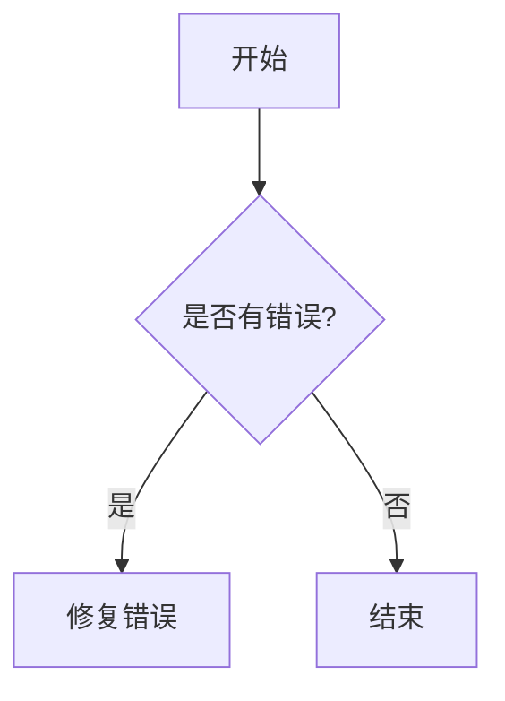
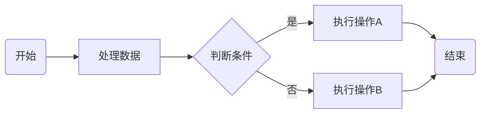
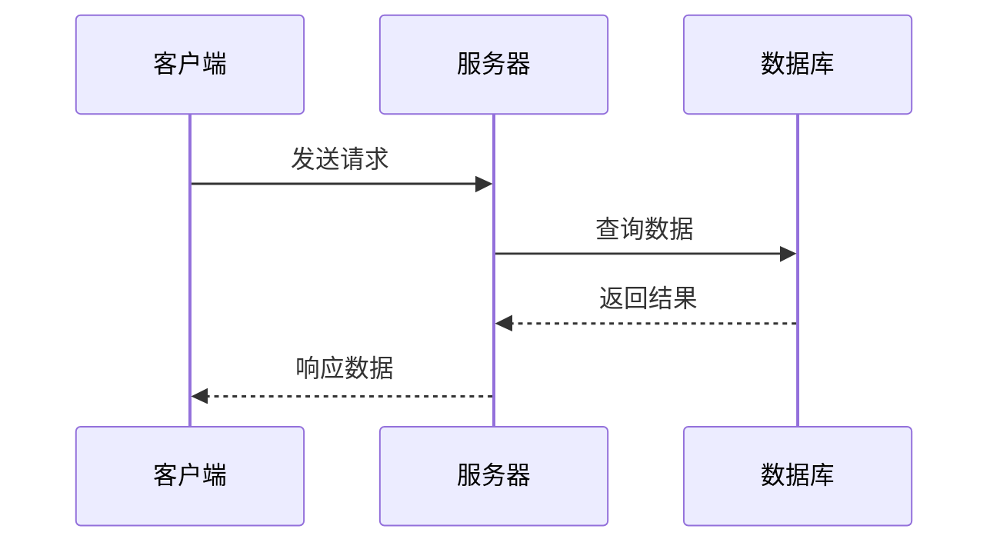

# [0017. markdown 图表绘制](https://github.com/tnotesjs/TNotes.markdown/tree/main/notes/0017.%20markdown%20%E5%9B%BE%E8%A1%A8%E7%BB%98%E5%88%B6)

<!-- region:toc -->

- [1. 🎯 本节内容](#1--本节内容)
- [2. 🫧 评价](#2--评价)
- [3. 🤔 markdown 中如何绘制图表？](#3--markdown-中如何绘制图表)
- [4. 🤔 Mermaid 是什么？如何在 markdown 中使用它？](#4--mermaid-是什么如何在-markdown-中使用它)
- [5. 🤔 如何用 Mermaid 绘制流程图？](#5--如何用-mermaid-绘制流程图)
- [6. 🤔 如何用 Mermaid 绘制时序图？](#6--如何用-mermaid-绘制时序图)
- [7. 🤔 除 Mermaid 外还有哪些 markdown 图表绘制方案？](#7--除-mermaid-外还有哪些-markdown-图表绘制方案)
- [8. 🤔 ASCII 图表是什么？具体如何绘制呢？](#8--ascii-图表是什么具体如何绘制呢)
- [9. 🔗 引用](#9--引用)

<!-- endregion:toc -->

## 1. 🎯 本节内容

- markdown 图表绘制（mermaid）

## 2. 🫧 评价

TNotes 中的图表主要是使用 Mermaid 来绘制的，也有一些图表是直接使用 ASCII 字符来绘制。

笔记中并没有过多介绍有关 mermaid 的具体语法细节，有关 mermaid 的详情，可自行查阅 [Mermaid 官方文档][2]。

现阶段（26.03） AI 的解决方案也相对比较成熟了，很多时候我们只需要告诉 AI 我们需要什么图表，让 AI 用 Mermaid 语法来帮我们完成绘图，最后将结果引入到 markdown 文档中即可。如果你还希望对图表进行二次编辑的话，那就得具备一定的 Mermaid 语法基础了。

## 3. 🤔 markdown 中如何绘制图表？

标准 markdown 本身没有图表绘制能力，需要借助扩展工具。

目前主流方案是在代码块中使用专用的图表描述语言（如 Mermaid），支持的渲染环境会将其转换为 SVG 图形。这种方式的优点是图表以纯文本形式维护，天然支持版本控制。

## 4. 🤔 Mermaid 是什么？如何在 markdown 中使用它？

- Mermaid 是一个基于 JavaScript 的图表绘制库，通过简洁的文本语法来描述各类图表，支持流程图、时序图、甘特图、类图、状态图等多种类型。
- 在 markdown 中，使用语言标识符为 `mermaid` 的围栏代码块来编写 Mermaid 图表：

````

````


GitHub、GitLab、Obsidian、VitePress 等主流平台均原生或通过插件支持 Mermaid 渲染。

## 5. 🤔 如何用 Mermaid 绘制流程图？

流程图使用 `graph` 或 `flowchart` 关键字，后跟方向（TD 上到下，LR 左到右等）：

````

````


节点形状通过不同括号定义：`[]` 矩形、`()` 圆角矩形、`{}` 菱形、`(())` 圆形等。

## 6. 🤔 如何用 Mermaid 绘制时序图？

时序图使用 `sequenceDiagram` 关键字，描述参与者之间的交互顺序：

````

````


箭头类型：`->>` 实线箭头、`-->>` 虚线箭头、`->` 实线无箭头。

## 7. 🤔 除 Mermaid 外还有哪些 markdown 图表绘制方案？

- PlantUML：专注于 UML 图表（类图、用例图、活动图等），语法比 Mermaid 更完整，但需要服务端渲染支持
- D2：较新的图表描述语言，语法简洁，支持布局算法，适合架构图
- ASCII 图表：使用纯文本字符手绘简单图形，无需任何渲染支持，兼容性最好但排版繁琐
- Graphviz（DOT 语言）：功能强大的网络图绘制工具，部分平台（如 GitLab）原生支持
- ……

## 8. 🤔 ASCII 图表是什么？具体如何绘制呢？

这玩意儿可以丢给 AI 来绘制，如果手敲的话，会很累……

`使用 ASCII 绘制一张图，介绍 Mermaid 都支持绘制哪些图表。` <- 将这句话发送给 AI。

以下是目前（26.03.07）DeepSeek 生成的内容：

```
                         🧜‍♀️  MERMAID 图表宇宙  🧜‍♀️
                             （支持的类型一览）

┌─────────────────────────────────────────────────────────────────┐
│                                                                 │
│  1. 流程图 (Flowchart)         示例:                            │
│     ┌────┐    ┌────┐    ┌────┐    ┌──────┐                     │
│     │开始│───→│步骤1│───→│判断│───→│结束  │                     │
│     └────┘    └────┘    └─┬──┘    └──────┘                     │
│                           │                                     │
│                           ↓                                     │
│                        ┌──────┐                                 │
│                        │步骤2 │                                 │
│                        └──────┘                                 │
│                                                                 │
│  2. 时序图 (Sequence Diagram)                                   │
│     ┌──┐      ┌──┐       ┌──┐                                  │
│     │A │─────→│B │──────→│C │                                  │
│     └──┘←─────└──┘←──────└──┘                                  │
│      交互消息流                                                  │
│                                                                 │
│  3. 甘特图 (Gantt)           4. 类图 (Class Diagram)           │
│     ┌────────┐                ┌──────────┐                     │
│     │任务1   │◄───日期1───►   │Animal    │                     │
│     ├────────┤                ├──────────┤                     │
│     │任务2   │                │+name     │                     │
│     └────────┘                │+eat()    │                     │
│                                └────┬─────┘                     │
│                                     △                            │
│                                ┌────┴─────┐                     │
│                                │  Dog     │                     │
│                                └──────────┘                     │
│                                                                 │
│  5. 状态图 (State Diagram)    6. 实体关系图 (ER Diagram)       │
│     [空闲] ──→ [忙碌]          [用户]1───◄拥有►───N[订单]      │
│       ↑          │              (关系示例)                       │
│       └──────────┘                                              │
│                                                                 │
│  7. 用户旅程图 (User Journey)  8. 象限图 (Quadrant Chart)      │
│     [阶段1]────[阶段2]           ▲                              │
│       开心 ☺     一般 😐         │                              │
│                                  ├──┬──┬──┬──►                 │
│                                                                 │
│  9. 饼图 (Pie Chart)          10. 需求图 (Requirement Diagram) │
│    ●  A: 30%                     [REQ-1]───►[SYS-1]            │
│    ◔  B: 70%                     需求关系                        │
│                                                                 │
│  11. Git图 (Git Graph)        12. C4 模型图 (C4 Diagram)       │
│    main: ──●──●──●               [用户]◄───►[系统]             │
│    dev:    └──●──●                                              │
│                                                                 │
│  13. 时间线图 (Timeline)       14. 思维导图 (Mindmap)           │
│    2023 ●──● 2024                根                             │
│    事件A  事件B                  ├─分支1                        │
│                                  └─分支2                        │
│                                                                 │
│  15. 象限图表 (XY Chart)       16. 甘特图增强版 (Timeline)     │
│      (结合了条形图等)              里程碑★                       │
│                                                                 │
└─────────────────────────────────────────────────────────────────┘

                     💡 小贴士：Mermaid 还支持
                   Sankey图、方块图、旅程地图等更多类型！
```

## 9. 🔗 引用

- [Mermaid - github][1]
- [Mermaid 官方文档][2]
- [PlantUML - github][3]
- [Graphviz - 官方文档][4]
- [D2 - github][5]

[1]: https://github.com/mermaid-js/mermaid
[2]: https://mermaid.js.org/
[3]: https://github.com/plantuml/plantuml
[4]: https://graphviz.org/
[5]: https://github.com/terrastruct/d2
