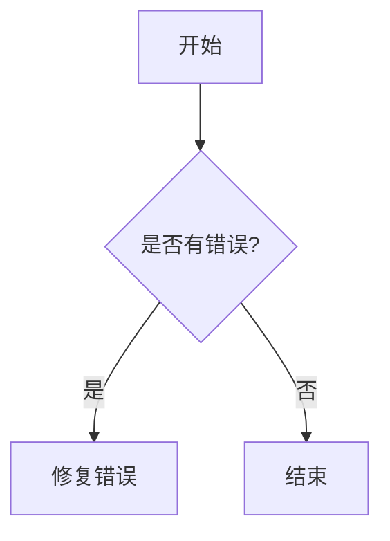
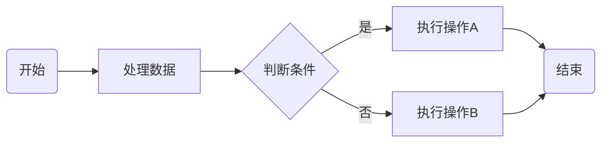
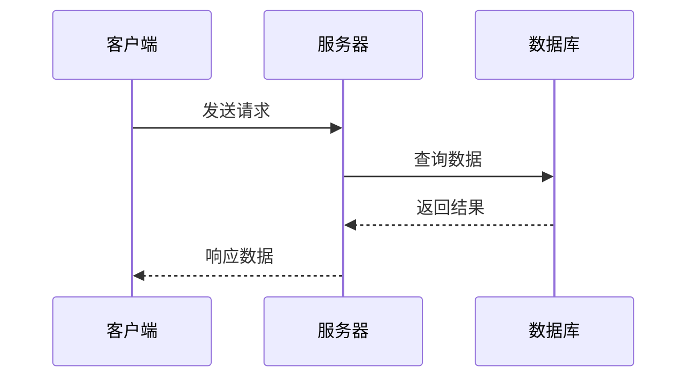

# [0017. markdown 图表绘制](https://github.com/tnotesjs/TNotes.markdown/tree/main/notes/0017.%20markdown%20%E5%9B%BE%E8%A1%A8%E7%BB%98%E5%88%B6)

<!-- region:toc -->

- [1. 🎯 本节内容](#1--本节内容)
- [2. 🫧 评价](#2--评价)
- [3. 🤔 markdown 中如何绘制图表？](#3--markdown-中如何绘制图表)
- [4. 🤔 Mermaid 是什么？如何在 markdown 中使用它？](#4--mermaid-是什么如何在-markdown-中使用它)
- [5. 🤔 如何用 Mermaid 绘制流程图？](#5--如何用-mermaid-绘制流程图)
- [6. 🤔 如何用 Mermaid 绘制时序图？](#6--如何用-mermaid-绘制时序图)
- [7. 🤔 除 Mermaid 外还有哪些 markdown 图表绘制方案？](#7--除-mermaid-外还有哪些-markdown-图表绘制方案)

<!-- endregion:toc -->

## 1. 🎯 本节内容

- todo

## 2. 🫧 评价

- todo

## 3. 🤔 markdown 中如何绘制图表？

标准 markdown 本身没有图表绘制能力，需要借助扩展工具。目前主流方案是在代码块中使用专用的图表描述语言（如 Mermaid），支持的渲染环境会将其转换为 SVG 图形。这种方式的优点是图表以纯文本形式维护，天然支持版本控制。

## 4. 🤔 Mermaid 是什么？如何在 markdown 中使用它？

Mermaid 是一个基于 JavaScript 的图表绘制库，通过简洁的文本语法来描述各类图表，支持流程图、时序图、甘特图、类图、状态图等多种类型。在 markdown 中，使用语言标识符为 `mermaid` 的围栏代码块来编写 Mermaid 图表：

````

````

GitHub、GitLab、Obsidian、VitePress 等主流平台均原生或通过插件支持 Mermaid 渲染。

## 5. 🤔 如何用 Mermaid 绘制流程图？

流程图使用 `graph` 或 `flowchart` 关键字，后跟方向（TD 上到下，LR 左到右等）：

````

````

节点形状通过不同括号定义：`[]` 矩形、`()` 圆角矩形、`{}` 菱形、`(())` 圆形等。

## 6. 🤔 如何用 Mermaid 绘制时序图？

时序图使用 `sequenceDiagram` 关键字，描述参与者之间的交互顺序：

````

````

箭头类型：`->>` 实线箭头、`-->>` 虚线箭头、`->` 实线无箭头。

## 7. 🤔 除 Mermaid 外还有哪些 markdown 图表绘制方案？

- PlantUML：专注于 UML 图表（类图、用例图、活动图等），语法比 Mermaid 更完整，但需要服务端渲染支持
- D2：较新的图表描述语言，语法简洁，支持布局算法，适合架构图
- Graphviz（DOT 语言）：功能强大的网络图绘制工具，部分平台（如 GitLab）原生支持
- ASCII 图表：使用纯文本字符手绘简单图形，无需任何渲染支持，兼容性最好但排版繁琐
- 外部图像引入：将图表在专业工具（如 draw.io、Figma）中绘制后导出为图片，再用 markdown 图片语法引入
